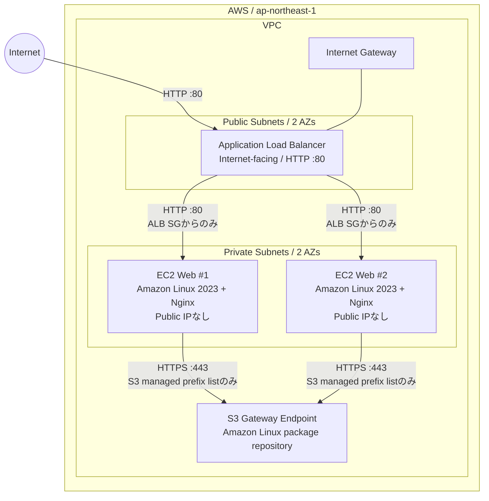

# アーキテクチャ

以下は公開用に一般化した構成図です。IPアドレス、AWSアカウントID、リソースIDは含めていません。

## 通信ルール

| 送信元 | 宛先 | プロトコル / ポート | 用途 |
| --- | --- | --- | --- |
| Internet | ALB | HTTP / 80 | Webアクセス |
| ALB Security Group | EC2 Security Group | HTTP / 80 | アプリケーション通信・ヘルスチェック |
| EC2 Security Group | AWS管理S3 Prefix List | HTTPS / 443 | Amazon Linuxパッケージ取得 |

EC2へのSSH（TCP 22）ルールは作成しない。Private SubnetのRoute Tableにはインターネット向けデフォルトルートを置かず、NAT Gatewayも使わない。
